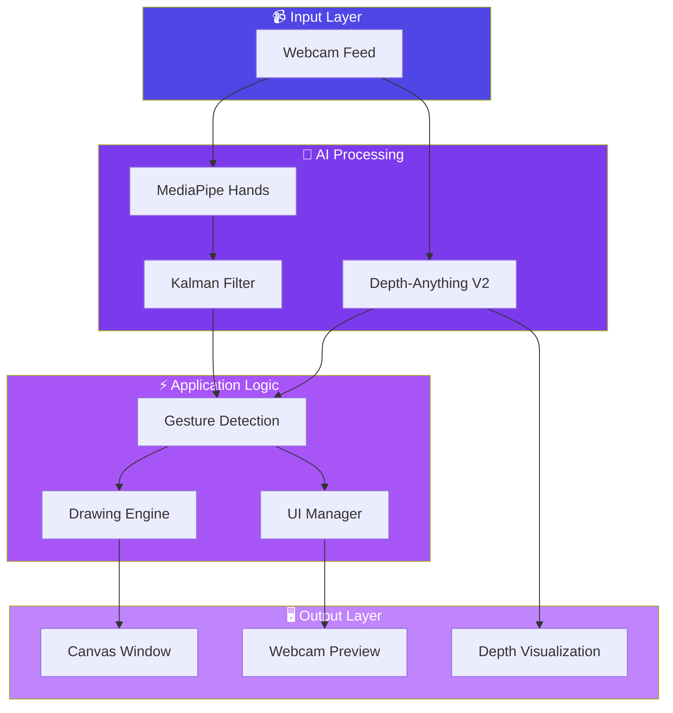
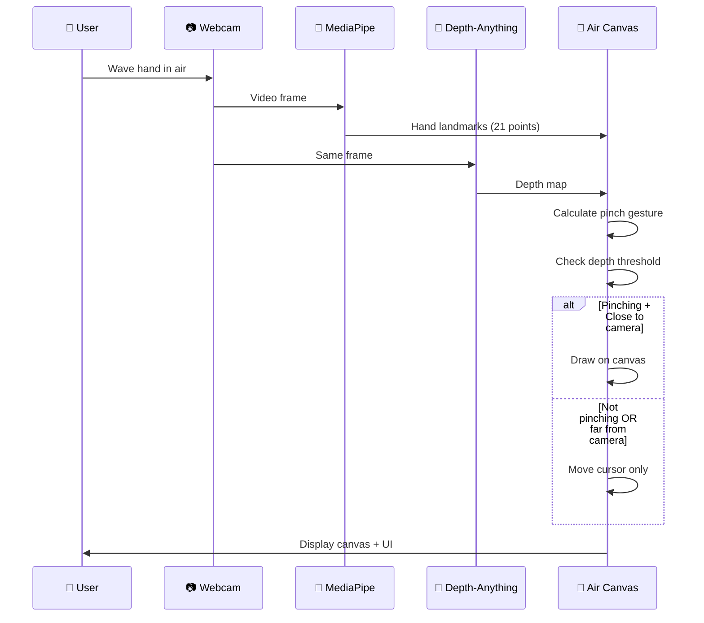

<div align="center">

<!-- Animated Header with Gradient Effect -->


<br/>

<!-- Animated Badges -->
[](https://www.python.org/)
[](https://opencv.org/)
[](https://mediapipe.dev/)
[](https://pytorch.org/)
[](LICENSE)

<br/>

<!-- Typing Animation Effect -->
<a href="https://git.io/typing-svg"></a>

<br/>

<!-- Quick Navigation -->
[**🚀 Quick Start**](#-quick-start) •
[**✨ Features**](#-features) •
[**🎮 Controls**](#-controls--shortcuts) •
[**⚙️ Configuration**](#%EF%B8%8F-configuration) •
[**📖 Documentation**](#-documentation)

<br/>

<!-- Demo GIF Placeholder -->


</div>

---

## 🔮 What is Air Canvas?

<table>
<tr>
<td width="60%">

**Air Canvas** is an innovative computer vision application that transforms your webcam into a **touch-free digital drawing tablet**. 

By leveraging the power of **MediaPipe** for precision hand tracking and **Depth-Anything V2** for intelligent depth perception, Air Canvas can distinguish between you hovering your hand *over* the canvas versus actually *touching* it — just like a real pen on paper!

Whether you're sketching, prototyping, or just having fun, Air Canvas makes digital art accessible without any physical touch.

</td>
<td width="40%">

```
    ╔═══════════════════════╗
    ║    🖐️ YOUR HAND      ║
    ║         ↓             ║
    ║    📷 WEBCAM         ║
    ║         ↓             ║
    ║    🧠 AI PROCESSING   ║
    ║         ↓             ║
    ║    🎨 CANVAS         ║
    ╚═══════════════════════╝
```

</td>
</tr>
</table>

---

## ✨ Features

<div align="center">

| Feature | Description |
|:---:|:---|
| 🖐️ **AI Hand Tracking** | Ultra-responsive finger detection using MediaPipe with Kalman filtering for silky-smooth cursor movement |
| 🧠 **Depth Perception** | Depth-Anything V2 integration enables hover vs. draw distinction — lift to pause, lower to draw! |
| ✏️ **Free Draw** | Smooth strokes with Catmull-Rom spline interpolation for natural, flowing lines |
| 📐 **Shape Tools** | Instant geometric primitives: **Lines**, **Rectangles**, and **Circles** |
| 🧽 **Eraser** | Multiple eraser sizes for precise corrections |
| 🎨 **Dynamic Palette** | Real-time color and brush size selection via virtual UI |
| 🔤 **OCR Integration** | Convert handwritten air-drawings to digital text using Tesseract |
| 📸 **Screenshot Export** | Save your artwork instantly with a single keystroke |
| 🔧 **Live Config Reload** | Modify `config.yaml` and apply changes without restarting |

</div>

---

## 🛠️ Tech Stack

<div align="center">



</div>

---

## 🚀 Quick Start

### Prerequisites

> [!IMPORTANT]
> Make sure you have the following installed before proceeding:
> - **Python 3.8+** with pip
> - **CUDA-capable GPU** (recommended for depth estimation)
> - **Webcam** connected to your system

### Step 1: Clone the Repository

```bash
git clone https://github.com/Rcidshacker/Air-canvas-new.git
cd Air-canvas-new
```

### Step 2: Create Virtual Environment

<details>
<summary><b>🪟 Windows</b></summary>

```powershell
python -m venv .depthv2
.\.depthv2\Scripts\activate
```

</details>

<details>
<summary><b>🐧 Linux / 🍎 macOS</b></summary>

```bash
python3 -m venv .depthv2
source .depthv2/bin/activate
```

</details>

### Step 3: Install Dependencies

```bash
pip install -r requirements.txt
```

### Step 4: Install Tesseract OCR

<details>
<summary><b>📦 Click to expand installation instructions</b></summary>

| Platform | Installation Command |
|:---:|:---|
| **Windows** | Download from [UB-Mannheim/tesseract](https://github.com/UB-Mannheim/tesseract/wiki) |
| **Linux** | `sudo apt-get install tesseract-ocr` |
| **macOS** | `brew install tesseract` |

> [!NOTE]
> **Windows Users**: Ensure the path in `depthtrack.py` (line 18) matches your Tesseract installation path.
> Default: `C:\Program Files\Tesseract-OCR\tesseract.exe`

</details>

### Step 5: Download Model Weights

> [!CAUTION]
> **This step is mandatory!** The depth model weights are too large to include in the repository.

1. Visit the [Depth-Anything V2 Repository](https://github.com/DepthAnything/Depth-Anything-V2)
2. Download **`depth_anything_v2_vits.pth`**
3. Create a `model_weights/` folder in the project root
4. Place the `.pth` file inside:

```
📦 Air-canvas-new/
 ┗ 📂 model_weights/
   ┗ 📜 depth_anything_v2_vits.pth  ← Place here!
```

### Step 6: Run the Application! 🎉

```bash
python depthtrack.py
```

---

## 🎮 Controls & Shortcuts

### ✋ Hand Gestures

<div align="center">

| Gesture | Visual | Action |
|:---:|:---:|:---|
| **Point** | ☝️ | Move cursor (hover mode) |
| **Pinch** | 🤏 | Draw / Select (thumb + index finger close) |
| **Release** | ✋ | Stop drawing (fingers apart) |

</div>

### ⌨️ Keyboard Shortcuts

<div align="center">

| Key | Icon | Function |
|:---:|:---:|:---|
| <kbd>R</kbd> | 🗑️ | **Reset** — Clear the entire canvas |
| <kbd>S</kbd> | 📸 | **Screenshot** — Save current canvas as PNG |
| <kbd>O</kbd> | 🔤 | **OCR** — Read text from canvas |
| <kbd>U</kbd> | 🔄 | **Update** — Reload config without restart |
| <kbd>B</kbd> / <kbd>V</kbd> | ☀️ | **Brightness** — Increase / Decrease |
| <kbd>C</kbd> / <kbd>X</kbd> | 🎚️ | **Contrast** — Increase / Decrease |
| <kbd>ESC</kbd> | ❌ | **Quit** — Exit application |

</div>

---

## ⚙️ Configuration

Customize every aspect of Air Canvas by editing `config.yaml`:

```yaml
# 🖼️ Display Settings
window_width: 1280
window_height: 800

# 🧠 AI Settings
use_depth: true           # Toggle depth estimation
depth_threshold: 0.6      # Sensitivity for "touch" detection
device: 'cuda'            # Use 'cpu' if no GPU available

# 🎨 Drawing Tools
brush_sizes: [5, 10, 15]
eraser_sizes: [20, 40]
colors:
  - [255, 255, 255]       # White
  - [0, 0, 0]             # Black
  - [255, 0, 0]           # Red
  - [0, 255, 0]           # Green
  - [0, 0, 255]           # Blue
  - [255, 255, 0]         # Yellow

# 🎯 Gesture Sensitivity
multi_pinch_threshold: 60
multi_separation_threshold: 50

# 📏 Smoothing (Kalman Filter)
kalman_process_noise: 1e-3
kalman_measurement_noise: 0.1
```

> [!TIP]
> Press <kbd>U</kbd> while running to reload config changes **without restarting** the app!

---

## 📂 Project Structure

```
📦 Air-canvas-new
 ┣ 📂 model_weights/          # ⚠️ Place depth model here
 ┃  ┗ 📜 depth_anything_v2_vits.pth
 ┣ 📜 depthtrack.py           # 🚀 Main application entry point
 ┣ 📜 config.yaml             # ⚙️ User configuration
 ┣ 📜 requirements.txt        # 📦 Python dependencies
 ┣ 🖼️ cursor.png              # 🎯 UI Cursor asset
 ┣ 🖼️ draw.png                # ✏️ Draw tool icon
 ┣ 🖼️ eraser.png              # 🧽 Eraser tool icon
 ┣ 🖼️ line.png                # 📏 Line tool icon
 ┣ 🖼️ rectangle.png           # ⬛ Rectangle tool icon
 ┣ 🖼️ circle.png              # ⭕ Circle tool icon
 ┗ 📜 README.md               # 📖 This file!
```

---

## 📖 Documentation

### How It Works



### Key Algorithms

| Algorithm | Purpose | Benefit |
|:---|:---|:---|
| **Catmull-Rom Spline** | Smooth curve interpolation | Natural, flowing brush strokes |
| **Kalman Filter** | Position prediction & smoothing | Reduces hand-tracking jitter |
| **Multi-Distance Pinch** | Precise gesture detection | Prevents accidental draws |

---

## 🤝 Contributing

<div align="center">

Contributions make the open-source community an amazing place to learn, inspire, and create.  
**Any contributions you make are greatly appreciated!**

</div>

1. **Fork** the project
2. **Create** your feature branch: `git checkout -b feature/AmazingFeature`
3. **Commit** your changes: `git commit -m 'Add some AmazingFeature'`
4. **Push** to the branch: `git push origin feature/AmazingFeature`
5. **Open** a Pull Request

---

## 📄 License

Distributed under the **MIT License**. See `LICENSE` for more information.

---

## 👨‍💻 Author

<div align="center">

<a href="https://github.com/Rcidshacker">
  
</a>

### **Ruchit Das**

*Computer Vision Enthusiast • Creative Developer*

[](https://www.linkedin.com/in/ruchit-das-3b6a8a252/)
[](https://github.com/Rcidshacker)

</div>

---

<div align="center">

<!-- Animated Footer -->


<br/>

**⭐ Star this repository if you found it helpful! ⭐**

Made with ❤️ and lots of ☕

</div>
